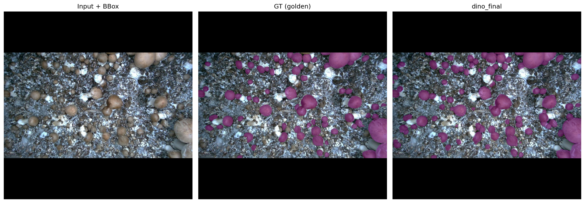
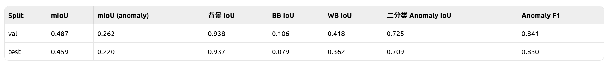
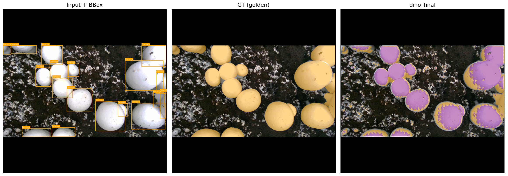
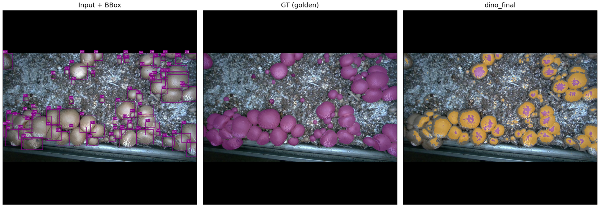

# b2pcap notes
20260701  
进展：以中柱采集并框标注的秀珍菇图像48张，按照32:8:8划分数据集，完全采文献方法训练测试，得到如下结果，取局部  

下一步：  
1. 应用于其他数据集m18k
2. 局部改进文献网络的系统结构

由于m18k中mushroom分类下包括BB和WB两类，两类存在颜色显著差异，分为两类，先筛选出了bb作为数据集，只一个标签的情况（后面好有个对比），运行代码，10个epoch后结果如下：  

验证集  
Anomaly mIoU：0.848  
Anomaly F1：0.918  
Anomaly Recall：0.987  

测试集  
Anomaly mIoU：0.850  
Anomaly F1：0.919  
Anomaly Recall：0.989  

  

下一步：
1. 改进上述方法，上述方法仍旧是将原始数据集拿过来进行SAM掩码，阅读m18k文献发现，原始数据集本身已经是SAM的产物，且又做了人工优化，所以再做一次SAM没必要，下一步直接用原始图像  
2. 将BB提取出来相当于只有一个标签，这与b2p原文不一致，下一步bb作为标签1，wb作为标签2  
3. 但未来应用于秀珍菇还是要退回到一个标签  

根据上述1和2，10个epoch后，效果比较差，与直觉一直——区分2个标签更复杂  
  
  
  
结论：10个epoch太少，导致黑白不分  

下一步：  
200epoch运行中，数小时后看结果